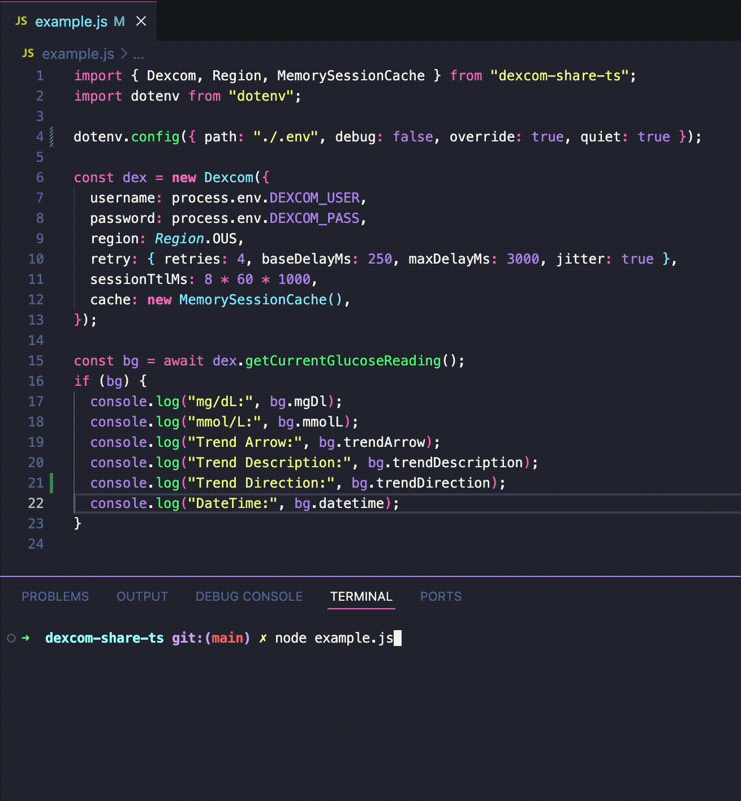

# dexcom-share-ts



[](https://github.com/dejurin/dexcom-share-ts/actions)
[](LICENSE)

A simple TypeScript API client for the **Dexcom Share** service with modern DX and runtime safety.

Based: [https://github.com/gagebenne/pydexcom](https://github.com/gagebenne/pydexcom)

- Dual exports: **ESM / CJS**
- **Zod** runtime response validation
- **Exponential backoff retries** (jitter, `Retry-After`)
- **Session ID caching** with TTL (pluggable store)
- Strict **TS types**, ESLint (typed rules), Node 18+ built-in `fetch`
- Tests: **node\:test** + **c8** (coverage), build via **tsup**

> **Disclaimer**: This is an unofficial library. It is not a medical device and must not be used for medical decisions.

---

## Installation

```bash
npm i dexcom-share-ts
```

Requires **Node 18+** (has global `fetch`).

---

## Quick Start

Download the [Dexcom G7 / G6 / G5 / G4](https://www.dexcom.com/apps) mobile app and [enable the Share service](https://provider.dexcom.com/education-research/cgm-education-use/videos/setting-dexcom-share-and-follow).

The Dexcom Share service requires setup of at least one follower to enable the share service, but `dexcom-share-ts` will use your (or the dependent's) credentials, not the follower's or manager's.

### ESM

```ts
import { Dexcom, Region } from "dexcom-share-ts";

const dex = new Dexcom({
  username: "user@example.com", // or +11234567890, or accountId (UUID)
  password: "your_password",
  region: Region.US, // "us" (default) | "ous" | "jp"
});

const reading = await dex.getCurrentGlucoseReading();
console.log(reading?.mgDl); // 85
console.log(reading?.mmolL); // 4.7
console.log(reading?.trendDirection); // "Flat"
console.log(reading?.trendDescription); // "steady"
console.log(reading?.trendArrow); // "→"
console.log(reading?.datetime); // Date
```

### CJS

```js
const { Dexcom, Region } = require("dexcom-share-ts");

const dex = new Dexcom({
  username: "user@example.com",
  password: "your_password",
  region: Region.US,
});

dex.getLatestGlucoseReading().then((r) => {
  console.log(r?.mgDl);
});
```

---

## Username vs Account ID

| Field       | Meaning                                 | When to use             |
| ----------- | --------------------------------------- | ----------------------- |
| `username`  | Email or phone as `+<country><number>`  | Usually enough          |
| `accountId` | UUID from Dexcom Account Management URL | Skip username auth path |

Example US phone formatting: `+11234567890`.

---

## API

### Constructor

```ts
new Dexcom(options: {
  password: string;                 // required
  username?: string;                // exactly one of username/accountId
  accountId?: string;               // UUID string
  region?: Region;                  // "us" | "ous" | "jp" (default: "us")
  cache?: SessionCache;             // pluggable session cache (default: in-memory)
  sessionTtlMs?: number;            // TTL for sessionId (default ~8 minutes)
  retry?: RetryOptions;             // network/HTTP retry config
})
```

**Types**

```ts
export enum Region {
  US = "us",
  OUS = "ous",
  JP = "jp",
}

export interface RetryOptions {
  retries?: number; // default 3
  baseDelayMs?: number; // default 200
  maxDelayMs?: number; // default 4000
  jitter?: boolean; // default true
  retryOnStatuses?: number[]; // default [429,500,502,503,504]
}

export interface SessionCache {
  get(): Promise<string | null>;
  set(id: string, ttlMs: number): Promise<void>;
  clear(): Promise<void>;
}
```

### Methods

```ts
/** Get up to maxCount readings within the last 'minutes'. */
getGlucoseReadings(minutes?: number, maxCount?: number): Promise<GlucoseReading[]>

/** Latest available reading within 24h (server window). */
getLatestGlucoseReading(): Promise<GlucoseReading | null>

/** Current reading (<= 10 minutes old). */
getCurrentGlucoseReading(): Promise<GlucoseReading | null>
```

**GlucoseReading**

```ts
interface GlucoseReading {
  mgDl: number; // mg/dL
  mmolL: number; // mmol/L (rounded to 1 decimal)
  trend: number; // 0..9 (see constants)
  trendDirection: string; // e.g., "Flat"
  trendDescription: string; // e.g., "steady"
  trendArrow: string; // unicode, e.g., "→"
  datetime: Date; // timestamp
  timezone?: string; // e.g., "-0400"
  toString(): string; // mgDl as string
}
```

---

## Features & Best Practices

### 1) Zod response validation

Unexpected shapes (e.g., `DT`, `Value`, `Trend`) are rejected with **`ZodError`** for early, actionable failures.

```ts
try {
  const r = await dex.getCurrentGlucoseReading();
} catch (err) {
  if ((err as Error).name === "ZodError") {
    // schema validation error
  }
}
```

### 2) Exponential backoff retries

- Defaults: 3 attempts; honors `Retry-After`; retry statuses: `429/500/502/503/504`.
- Recommended: `baseDelayMs 200–250`, `maxDelayMs 3000–4000`, `jitter: true`.

```ts
const dex = new Dexcom({
  username: "u",
  password: "p",
  retry: { retries: 4, baseDelayMs: 250, maxDelayMs: 3000, jitter: true },
});
```

### 3) Session ID cache with TTL (pluggable)

- Fewer logins → lower latency and lower chance to hit auth limits.
- Safe invalidation: on `SessionError`, cache is cleared and session is re-established.
- For distributed setups, key your cache by `region + accountId`.

#### In-memory (default)

```ts
import { MemorySessionCache } from "dexcom-share-ts";

const dex = new Dexcom({
  username: "user@example.com",
  password: "secret",
  cache: new MemorySessionCache(),
  sessionTtlMs: 8 * 60_000,
});
```

#### Redis (example)

```ts
import { createClient } from "redis";
import { Dexcom, Region } from "dexcom-share-ts";

class RedisSessionCache {
  constructor(url, key) {
    this.client = createClient({ url });
    this.key = key;
  }
  async get() {
    if (!this.client.isOpen) await this.client.connect();
    return this.client.get(this.key);
  }
  async set(id, ttlMs) {
    if (!this.client.isOpen) await this.client.connect();
    await this.client.set(this.key, id, { EX: Math.max(1, Math.floor(ttlMs / 1000)) });
  }
  async clear() {
    if (!this.client.isOpen) await this.client.connect();
    await this.client.del(this.key);
  }
}

const cache = new RedisSessionCache(process.env.REDIS_URL, `dex:session:${Region.US}:<accountId>`);
const dex = new Dexcom({ accountId: "<uuid>", password: process.env.DEXCOM_PASS, cache });
```

**TTL tip:** 5–10 minutes is a good default. Expiration triggers transparent re-login.

---

## Error handling

The client maps Dexcom responses to specialized error classes:

| Class           | When it happens                          | Typical message                                                      |
| --------------- | ---------------------------------------- | -------------------------------------------------------------------- |
| `AccountError`  | Bad login/limits                         | `Failed to authenticate`, `Maximum authentication attempts exceeded` |
| `SessionError`  | Session missing/expired                  | `Session ID not found`, `Session not active or timed out`            |
| `ArgumentError` | Invalid input from caller                | `Username must be non-empty string`, `Account ID must be UUID`       |
| `ServerError`   | Unexpected/invalid server responses/JSON | `Unknown error code in server response`, `Invalid or malformed JSON` |

Example:

```ts
import { AccountError, SessionError, ArgumentError, ServerError } from "dexcom-share-ts";

try {
  const r = await dex.getGlucoseReadings(10, 1);
} catch (e) {
  if (e instanceof AccountError) {
    // wrong credentials, max attempts, etc.
  } else if (e instanceof SessionError) {
    // session invalid/expired (auto-heals)
  } else if (e instanceof ArgumentError) {
    // bad caller arguments
  } else if (e instanceof ServerError) {
    // unexpected server payload/JSON
  }
}
```

---

## Compatibility

- **Node 18+** (global `fetch`).
- **Server-side** usage recommended. Browser/Edge likely blocked by CORS and Share policy.
- **ESM/CJS** dual exports; `sideEffects: false` for tree-shaking.

---

## pydexcom vs dexcom-share-ts

| Feature/Area         | pydexcom (Python) | dexcom-share-ts    |
| -------------------- | ----------------- | ------------------ |
| Language             | Python            | TypeScript/JS      |
| ESM/CJS              | —                 | ✅                 |
| Zod validation       | —                 | ✅                 |
| Exponential retries  | partial           | ✅ (configurable)  |
| Session ID TTL cache | —                 | ✅ (pluggable)     |
| Tests/Coverage       | yes               | ✅ node\:test + c8 |

---

## Dev Scripts

```bash
npm run build      # tsup build (esm/cjs + dts + sourcemaps)
npm run lint       # ESLint (flat config, typed rules)
npm run typecheck  # tsc --noEmit
npm run test       # node:test + c8 coverage
npm run test:ci    # coverage thresholds (branches 80, funcs 85, lines 98)
```

`prepublishOnly` is configured to lint/typecheck/test before publishing.

---

## FAQ

**My password doesn’t work. What now?**
Most common causes:

1. Wrong credentials — verify in your region’s Dexcom Account Management portal.
2. Wrong `region` (`us`/`ous`/`jp`).
3. Bad `username` format (phones must be `+<country><number>`).
4. Use **your** Dexcom Share credentials (not a follower’s). At least **one follower** must be configured.
5. Try `accountId` (UUID from the Account Management URL).

**Why not the official Dexcom Developer API?**
The official API is retrospective (great for stats/trends). For near-real-time values, Share works better.

**Dexcom Stelo?**
Not supported — Stelo is not compatible with Dexcom Share.

**Can I disable Zod in production?**
You can, though it’s not recommended. If latency is critical, keep Zod in tests/CI or enable it selectively.

**Rate limiting?**
The client respects `Retry-After` and retries only on sensible status codes. Reduce auth pressure with the session TTL cache.

**ESM/CJS support?**
Yes — dual exports; use `import` (ESM) or `require` (CJS).

**Security tips**

- Do not log `sessionId`.
- External caches must have TTL and restricted access.
- Keep credentials in secrets/ENV.

---

## Recipes

### Serverless (Vercel/Netlify/Lambda)

```ts
import { Dexcom } from "dexcom-share-ts";

export default async function handler() {
  const dex = new Dexcom({
    username: process.env.DEXCOM_USER!,
    password: process.env.DEXCOM_PASS!,
    retry: { retries: 2, baseDelayMs: 150, maxDelayMs: 1500 },
    sessionTtlMs: 6 * 60_000,
  });
  const r = await dex.getCurrentGlucoseReading();
  return new Response(JSON.stringify(r), { status: 200 });
}
```

### Strong error typing

```ts
import { Dexcom, AccountError, SessionError, ServerError, ArgumentError } from "dexcom-share-ts";

try {
  const dex = new Dexcom({ username: "u", password: "p" });
  const bg = await dex.getLatestGlucoseReading();
} catch (e) {
  if (e instanceof AccountError) {
    // credentials problem
  } else if (e instanceof SessionError) {
    // session invalid/expired
  } else if (e instanceof ArgumentError) {
    // bad input
  } else if (e instanceof ServerError) {
    // server anomalies
  }
}
```

---

## Contributing

Contributions welcome:

- Keep ESLint style and strong typing (lint/typecheck/test).
- Cover new branches with tests (node\:test + c8).
- Update README/JSDoc where applicable.

---

## License

[MIT](LICENSE) © dejurin and contributors
